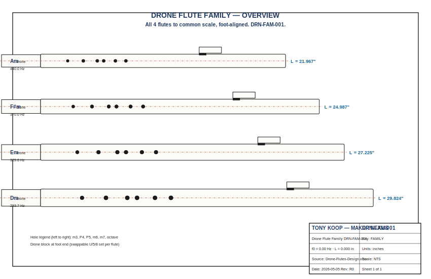

# Drone Flutes

A four-member family of Native American style drone flutes — Am, F#m, Em, Dm — built on Tony's open-pipe parametric design pipeline, with hybrid CNC + lathe + facet construction and Broinwood-style geometric CNC inlay in hard maple over walnut bodies. Each flute ships with three swappable drone blocks (unison, fifth-below, octave-below) so the player can change drone tuning without touching the melody side.

This is `DRN-FAM-001` in the catalog, status **in-progress**.

> Aesthetic references: [Elemental Flutes gallery](https://elementalflutes.com/gallery) for the drone-flute form and [Broinwood](https://broinwood.com) for the inlay style. Engineering reference: the [`flutes`](https://github.com/tonykoop/flutes) repo for NAF K2 empirical corrections (150+ flute dataset).



## What's in the box

```
.
├── Drone-Flutes-Design.xlsx           ← parametric source of truth (284 formulas)
├── Drone-Flutes-BOM-Build-Method.docx ← shop-floor build doc (v3-style companion)
├── design.md                          ← physics + family narrative
├── family-spec.csv                    ← row per family member, drives generators
├── bom.csv · sourcing.csv             ← what to buy, where, for how much
├── cut-list.csv · validation.csv      ← shop ops + tuning targets
├── assembly-manual.md                 ← shop-floor cheat sheet
├── supplier-rfq.md                    ← 3 RFQ drafts ready to send
├── drawing-brief.md · visual-bom-brief.md
├── wolfram-starter.wl                 ← interactive Wolfram notebook
├── risks.md                           ← red-team failure-mode walk
├── capstone-deck.pptx                 ← recruiter / collaborator deck
├── print-packet.pdf                   ← shop-floor printable
├── site/index.html                    ← recruiter-facing static site
├── drawings/                          ← per-key SVG drawings + assembly + family-overview
├── inlay-patterns/{Am,Fsm,Em,Dm}/    ← 16 DXF + 16 SVG inlay patterns
├── sw-reference/                      ← SolidWorks master layout reference
├── cad/, cnc/, images/, data/        ← placeholders for binary assets
└── capstone-manifest.json             ← machine-readable manifest of everything above
```

## How it's built

1. **Excel `Master_Inputs` sheet** is the single edit surface for every dimension. Blue cells are inputs; black cells are formulas. Names match the SolidWorks global variables exactly.
2. **SolidWorks** reads from Excel via a linked design table (configurations: Am, F#m, Em, Dm). Master sketch on the Front plane drives every other sketch via convert-entities and pierce relations.
3. **CNC G-code** is generated in V-Carve from SolidWorks DXFs. Bore profile (1/4 downcut) → SAC pocket → splitting edge (1/16 upcut climb) → octagon facet pass (1/2 downcut, V-block jig) → inlay pockets (1/16 upcut) → finger holes (drill press, brad-point bits).
4. **Lathe** turns each glued blank to `body_OD_round` between centers; faceting then brings it to `body_OD_flat`.
5. **Drone blocks** are lathe-turned with a 0.75" tenon at 0.005" slip-fit clearance. Three blocks per flute (U / 5 / 8) for swappable drone tuning.

## Family table

| Member | Key | f₀ (Hz) | bore_ID | L_total | Chamber:bore |
|---|---|---|---|---|---|
| DRN-Am  | Am  | 440.000 | 0.750" | 21.97 in | 20.4 |
| DRN-Fsm | F#m | 369.994 | 0.875" | 24.99 in | 21.0 |
| DRN-Em  | Em  | 329.628 | 1.000" | 27.23 in | 20.7 |
| DRN-Dm  | Dm  | 293.665 | 1.125" | 29.82 in | 20.8 |

All chamber:bore ratios sit in Tony's 17–21 sweet spot. Hole positions follow `pos_from_foot = L_acoustic_corrected × (1 − f₀/f_hole)` with K2 piecewise correction by bore size.

## Sister repos

This packet is part of Tony's open-pipe woodwind cluster. Cross-references:

- [`flutes`](https://github.com/tonykoop/flutes) — NAF family + K2 corrections (engineering reference)
- [`fujara`](https://github.com/tonykoop/fujara) — Slovak overtone flute (related physics)
- [`transverse-flute`](https://github.com/tonykoop/transverse-flute) — slip-cast transverse flute family
- [`shakuhachi`](https://github.com/tonykoop/shakuhachi)

For the cross-cluster catalog see `instrument-maker-v4` skill `references/repo-relationships.yaml`.

## Skill index used

- [instrument-maker-v4](https://...) — orchestrator + specialist sub-agents (acoustician, manufacturing-planner, documentarian, verifier, red-team)
- [xlsx](https://...) — Drone-Flutes-Design.xlsx
- [docx](https://...) — SolidWorks reference + BOM doc
- [pptx](https://...) — capstone-deck.pptx
- [pdf](https://...) — print-packet.pdf

## Roadmap

- [x] Excel design workbook with 284 formulas and 6 sheets
- [x] SolidWorks reference doc with global variables + design table setup
- [x] BOM + Build Method doc (v3-style companion)
- [x] CNC inlay patterns: 4 keys × 4 patterns × 2 formats = 32 files
- [x] v4 deliverables: design.md, family-spec, BOM/sourcing/cut/validation CSVs, assembly manual, RFQ, briefs, Wolfram starter, risks, capstone deck, print packet, site
- [ ] Build flute 1 (F#m) and tune-validate
- [ ] Update K2 corrections from measured data via `record_measurement.py`
- [ ] Photograph all 4 finished flutes for hero image
- [ ] Publish `site/` to GitHub Pages

## License

See [LICENSE](LICENSE).

## Contact

Tony Koop · tonykoop@gmail.com
